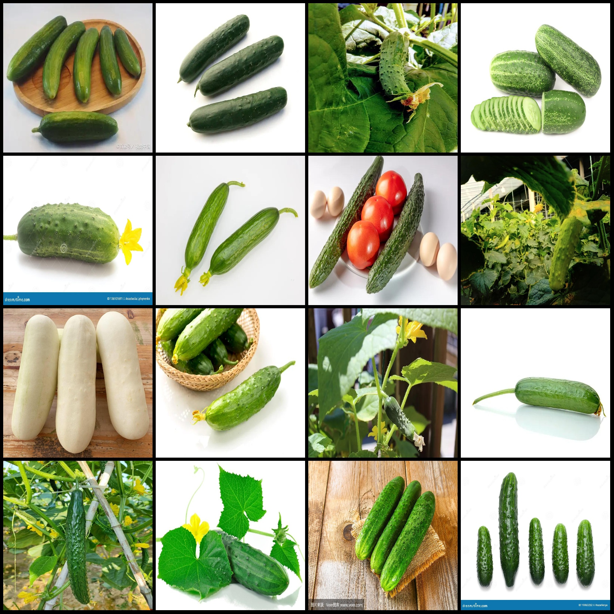
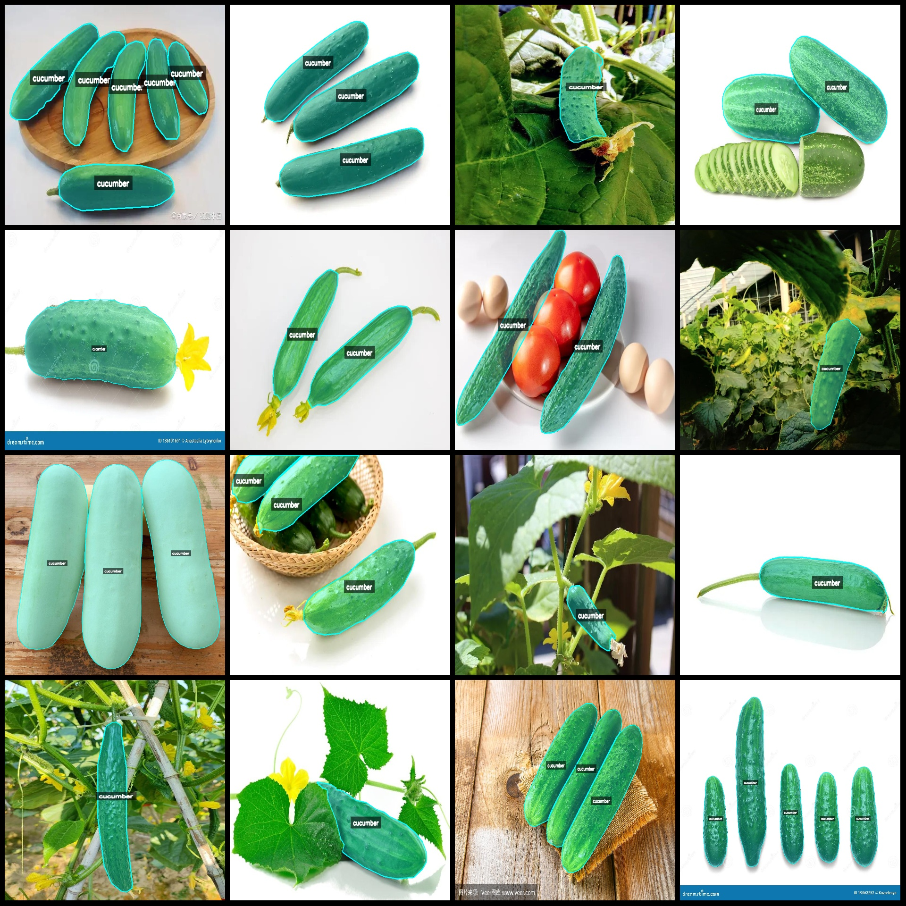
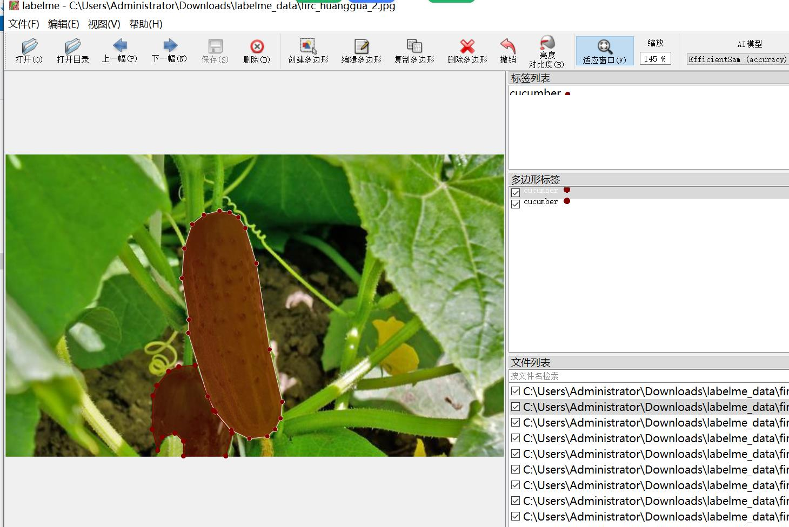

# Smart Fruit Orchard Cucumber Segmentation Dataset

## Dataset Format: labelme format (excluding mask files, only containing jpg images and corresponding json files)

### Image Count (Number of JPG Files): 1002
### Annotation Count (Number of JSON Files): 1002
### Number of Annotation Categories: 1

#### Annotation Category Name: "cucumber"

### Boxes Count per Category:
- cucumber count = 2680
- Total boxes = 2680

#### Labelme Tool Version: 5.5.0

### Image Resolutions: Multiple resolution images, such as 800x533, 533x800, etc.

#### Annotation Rules: Polygon box for categories.

#### Important Note: The dataset can be edited using labelme, but the JSON dataset needs to be converted into either mask, YOLOF, or COCO format for semantic segmentation or instance segmentation.

#### Special Disclaimer: This dataset does not guarantee the accuracy of the trained model or weight files.

### Image Preview:

#### Example of Annotation (randomly select 16 images):

#### Annotation drawing results:

#### Labelme editing image example:

## Images

Here is a pay link on Stripe ( https://buy.stripe.com/3cs8yP7sY87d0vu9AB ). Please contact me lonlonago@foxmail.com after funding $89, and I will send you a complete data files , thank you!

